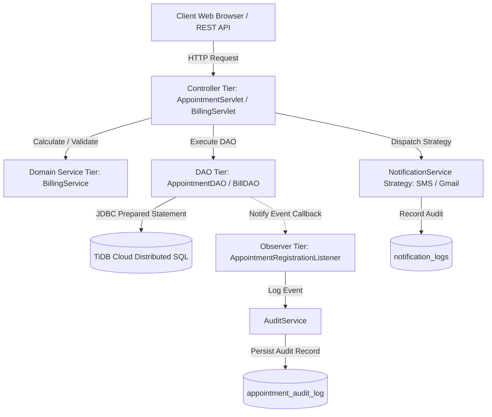

# Architectural Decision Record (ADR): Application-Tier Business Logic & Auditing for Distributed Cloud-Native Databases

**Module**: CIS6003 Advanced Software Engineering  
**System**: Sunrise Dental Clinic Management System  
**Target Database**: Cloud-Native Distributed SQL (TiDB Cloud / MySQL-compatible)  

---

## 1. Context and Problem Statement

Traditional monolithic enterprise architectures often relied heavily on relational database procedural features, such as **database triggers**, **stored procedures**, and **database-level sequence generators**, to enforce business constraints, calculate invoices, and write audit logs.

In the Sunrise Dental Clinic Management System, the persistence tier is hosted on **TiDB Cloud (Serverless Distributed SQL)**. Distributed SQL databases separate computing (TiDB SQL layer) from distributed consensus-based storage (TiKV using the Raft protocol). In this cloud-native paradigm:
- **TiDB does not support native database triggers or stored procedures.**
- Executing business calculations and auditing directly in procedural database code introduces severe distributed locking contention, network latency across Raft consensus groups, and horizontal scalability bottlenecks.

---

## 2. Decision: Shift Logic and Auditing to the Application Tier

We made the architectural decision to **deliberately shift all business calculations, auditing mechanisms, and notification workflows out of the database tier and into the application tier**, leveraging proven software design patterns (GoF).

---

## 3. Design Patterns Applied

### 3.1. Observer Pattern for Application-Tier Auditing (`AuditService`)
- **Problem**: Need an immutable audit log (`appointment_audit_log`) whenever an appointment is registered without relying on MySQL triggers.
- **Implementation**:
  - Defined `com.sunrisedental.service.observer.AppointmentRegistrationListener` interface.
  - Implemented `com.sunrisedental.service.AuditService` as an Observer.
  - `AppointmentDAOImpl.registerAppointment()` acts as the Subject: upon a successful row insertion, it notifies all registered listeners in memory (`AuditService.onAppointmentRegistered()`).
  - `AuditService` formats and logs an immutable audit trail entry containing the timestamp, performing user/system handle, appointment identifier, and clinical details into `appointment_audit_log`.

### 3.2. Pure Domain Service Encapsulation (`BillingService`)
- **Problem**: Stored procedure calculation of invoice amounts (`Total = Treatment Cost + Consultation Fee`) is unavailable and vulnerable to distributed locking.
- **Implementation**:
  - Implemented pure business calculations in `com.sunrisedental.service.BillingService`.
  - Thoroughly covered with Test-Driven Development (TDD) test suites in `BillingServiceTest.java`.
  - Ensures deterministic invoice generation, boundary validation (rejection of negative fees), and formatted printable receipts without database compute overhead.

### 3.3. Strategy & Observer Patterns for Notifications (`NotificationService`)
- **Problem**: Need flexible multi-channel patient notifications (SMS, Gmail/Email) that audit all dispatches into `notification_logs`.
- **Implementation**:
  - `NotificationService` interface defines the strategy contract.
  - Concrete strategies `SmsNotificationService` and `GmailNotificationService` encapsulate format logic and dispatch auditing.

---

## 4. Key Architectural Benefits

| Metric | Traditional Database Stored Procs & Triggers | Application-Tier Design Patterns (Implemented) |
| :--- | :--- | :--- |
| **Distributed Scalability** | Poor: Causes distributed locks and single-node bottlenecks in Raft groups. | Excellent: Stateless application tier scales horizontally with zero database compute contention. |
| **Cloud TiDB Compatibility** | Incompatible: Unsupported syntax in cloud-native distributed engines. | 100% Compatible: Employs standard ANSI SQL `INSERT`/`UPDATE` PreparedStatements. |
| **Testability (TDD)** | Difficult: Requires running live database instances and state rollbacks. | High: Domain logic, observers, and strategies can be unit-tested with JUnit 5 and mocks in milliseconds. |
| **Vendor Portability** | Vendor lock-in: Proprietary dialect code (PL/SQL, T-SQL). | High Portability: Application logic is written in Java 17; database schema remains clean DDL. |
| **Maintainability & Debugging**| Opaque trigger side-effects; hard to trace errors in production. | Transparent: Observable Java logs and explicit stack traces with comprehensive unit tests. |

---

## 5. Conclusion

By shifting business calculations to `BillingService` and utilizing the **Observer Pattern** for `AuditService`, the Sunrise Dental Clinic Management System achieves full alignment with modern cloud-native architectural standards, guaranteeing high performance on distributed databases like TiDB without sacrificing data auditability or business logic integrity.
